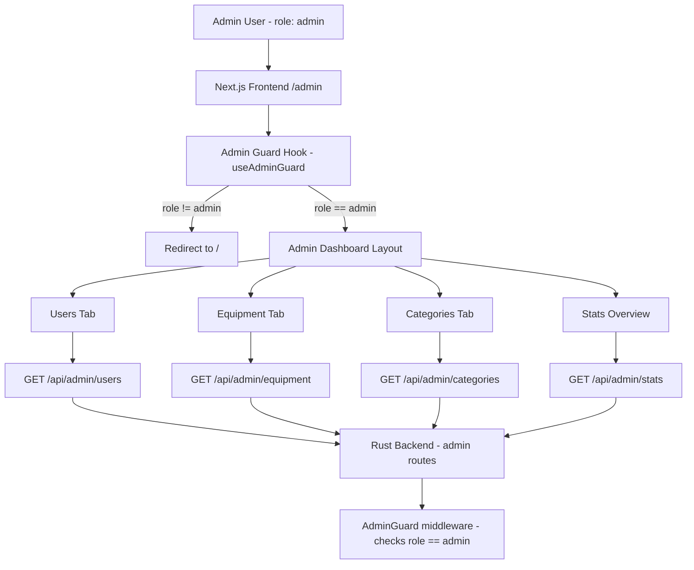

# Admin Dashboard Plan

## Overview

Add a full-featured admin dashboard accessible only to users with the `admin` role (resolved from Auth0 token claims via [`map_auth0_role()`](src/utils/auth0_claims.rs:57)). The dashboard gives the admin a single place to manage users, equipment listings, categories, and messages — with quality-of-life features baked in throughout.

---

## Role & Access Model (Existing)

| Role | Source | Capabilities |
|------|--------|-------------|
| `renter` | Default when no claim | Browse & rent |
| `owner` | Auth0 claim | Create/manage own listings |
| `admin` | Auth0 claim | Everything + admin dashboard |

The backend already resolves the role from the JWT in [`src/utils/auth0_claims.rs`](src/utils/auth0_claims.rs:57) and exposes it via [`Auth0UserContext`](src/utils/auth0_claims.rs:49). The [`/api/auth/me`](src/api/routes/auth.rs:24) endpoint returns the current user's role.

---

## Architecture Overview



---

## Backend Changes

### 1. New Admin Routes Module

**File:** [`src/api/routes/admin.rs`](src/api/routes/admin.rs) *(new)*

Register under `/api/admin/*` — all routes protected by an inline admin role check (same pattern as the `owner` check in [`create_equipment()`](src/api/routes/equipment.rs:54)).

#### Endpoints

| Method | Path | Description |
|--------|------|-------------|
| `GET` | `/api/admin/stats` | Platform overview counts |
| `GET` | `/api/admin/users` | Paginated user list with search |
| `GET` | `/api/admin/users/{id}` | Full user detail |
| `PUT` | `/api/admin/users/{id}/role` | Change a user's role |
| `DELETE` | `/api/admin/users/{id}` | Delete a user |
| `GET` | `/api/admin/equipment` | All equipment with owner info |
| `DELETE` | `/api/admin/equipment/{id}` | Force-delete any listing |
| `PUT` | `/api/admin/equipment/{id}/availability` | Toggle availability |
| `GET` | `/api/admin/categories` | List all categories |
| `POST` | `/api/admin/categories` | Create a new category |
| `PUT` | `/api/admin/categories/{id}` | Update a category |
| `DELETE` | `/api/admin/categories/{id}` | Delete a category |

### 2. Admin DTOs

**File:** [`src/api/dtos/admin_dto.rs`](src/api/dtos/admin_dto.rs) *(new)*

```
AdminStatsResponse { total_users, total_equipment, available_equipment, total_categories }
AdminUserListResponse { users: Vec<AdminUserRow>, total, page, per_page }
AdminUserRow { id, email, role, username, full_name, created_at, equipment_count }
AdminUpdateRoleRequest { role: String }  // "renter" | "owner" | "admin"
AdminEquipmentListResponse { equipment: Vec<AdminEquipmentRow>, total, page, per_page }
AdminEquipmentRow { id, title, owner_email, category_name, daily_rate, is_available, created_at }
AdminCategoryRequest { name, description, parent_id? }
```

### 3. Repository Extensions

**File:** [`src/infrastructure/repositories/traits.rs`](src/infrastructure/repositories/traits.rs)

Add to `UserRepository` trait:
- `list_all(limit, offset) -> AppResult<Vec<User>>`
- `count_all() -> AppResult<i64>`
- `update_role(id, role) -> AppResult<User>`

Add to `EquipmentRepository` trait:
- `count_all() -> AppResult<i64>`
- `list_all_with_owner(limit, offset) -> AppResult<Vec<EquipmentWithOwner>>`

Add to `CategoryRepository` trait:
- `create(category) -> AppResult<Category>`
- `update(category) -> AppResult<Category>`
- `delete(id) -> AppResult<()>`

### 4. Admin Service

**File:** [`src/application/admin_service.rs`](src/application/admin_service.rs) *(new)*

Encapsulates all admin business logic:
- `get_stats()` — aggregate counts
- `list_users(page, per_page, search_query)` — paginated + searchable
- `update_user_role(actor_id, target_id, new_role)` — prevents self-demotion
- `delete_user(actor_id, target_id)` — prevents self-deletion
- `list_equipment(page, per_page)` — all listings with owner info
- `force_delete_equipment(id)`
- `toggle_equipment_availability(id)`
- `list_categories()`, `create_category()`, `update_category()`, `delete_category()`

### 5. Wire Up in [`src/api/routes/mod.rs`](src/api/routes/mod.rs)

Register the new `/admin` scope.

---

## Frontend Changes

### 1. Admin Guard Utility

**File:** [`frontend/src/hooks/useAdminGuard.ts`](frontend/src/hooks/useAdminGuard.ts) *(new)*

A client-side hook that:
1. Calls `/api/proxy/api/auth/me`
2. Checks `user.role === "admin"`
3. Redirects to `/` with a toast if not admin

Also a server-side helper in [`frontend/src/lib/adminGuard.ts`](frontend/src/lib/adminGuard.ts) *(new)* for server components that redirects to `/` if role is not `admin`.

### 2. Admin Layout

**File:** [`frontend/src/app/admin/layout.tsx`](frontend/src/app/admin/layout.tsx) *(new)*

- Sidebar navigation with icons for each section
- Breadcrumb trail
- Role badge showing "Admin" in the header
- Responsive: collapses to icon-only sidebar on mobile

### 3. Admin Dashboard Pages

#### Overview / Stats Page
**File:** [`frontend/src/app/admin/page.tsx`](frontend/src/app/admin/page.tsx) *(new)*

- 4 stat cards: Total Users, Total Listings, Available Listings, Categories
- Quick-action buttons: "Add Category", "View All Users"
- Recent activity feed (last 5 new users, last 5 new listings)

#### Users Management Page
**File:** [`frontend/src/app/admin/users/page.tsx`](frontend/src/app/admin/users/page.tsx) *(new)*

QoL features:
- **Search bar** — filter by email or username (debounced, 300ms)
- **Role filter** dropdown — All / Renter / Owner / Admin
- **Sortable columns** — email, role, created_at
- **Inline role change** — dropdown in the table row, saves on change with optimistic update + toast confirmation
- **Pagination** — page size selector (10/25/50), prev/next buttons
- **Confirmation dialog** before deleting a user
- **Copy user ID** button (clipboard icon) on each row
- **Row click** → opens user detail side-panel (no page navigation)

#### Equipment Management Page
**File:** [`frontend/src/app/admin/equipment/page.tsx`](frontend/src/app/admin/equipment/page.tsx) *(new)*

QoL features:
- **Search bar** — filter by title or owner email
- **Availability toggle** — inline switch per row, instant update
- **Category filter** dropdown
- **Bulk select** — checkboxes + "Delete Selected" action
- **Confirmation dialog** before bulk/single delete
- **Link to public listing** — external link icon opens `/equipment/{id}` in new tab

#### Categories Management Page
**File:** [`frontend/src/app/admin/categories/page.tsx`](frontend/src/app/admin/categories/page.tsx) *(new)*

QoL features:
- **Inline create form** at top of list — name + description fields, submit with Enter
- **Inline edit** — click a category name to edit in-place
- **Delete with confirmation** — shows equipment count warning if category has listings
- **Drag-to-reorder** (optional stretch goal) for display order

### 4. Navbar Update

**File:** [`frontend/src/components/Navbar.tsx`](frontend/src/components/Navbar.tsx)

- Add "Admin" link in the nav (only rendered when `user.role === "admin"`)
- Show a shield/lock icon next to the Admin link for visual clarity

### 5. Shared Admin Components

**File:** [`frontend/src/components/admin/`](frontend/src/components/admin/) *(new directory)*

- `StatCard.tsx` — reusable metric card with icon, value, label
- `DataTable.tsx` — generic sortable/paginated table wrapper
- `ConfirmDialog.tsx` — reusable "Are you sure?" modal
- `RoleBadge.tsx` — colored badge for renter/owner/admin
- `SearchInput.tsx` — debounced search input with clear button

---

## QoL Feature Summary

| Feature | Where | Benefit |
|---------|-------|---------|
| Debounced search | Users & Equipment tables | No API spam while typing |
| Inline role change | Users table | No separate edit page needed |
| Optimistic updates | Role change, availability toggle | Instant UI feedback |
| Toast notifications | All mutations | Clear success/error feedback |
| Confirmation dialogs | All destructive actions | Prevent accidental deletes |
| Copy-to-clipboard | User ID column | Easy ID sharing for debugging |
| Side-panel detail | User row click | Context without losing list position |
| Bulk actions | Equipment table | Efficient cleanup of many listings |
| Equipment count warning | Category delete | Prevent orphaned listings |
| Admin badge in Navbar | Navbar | Quick visual role indicator |
| Role-based nav item | Navbar | Admin link only visible to admins |
| Server-side guard | Admin layout | Hard redirect before page renders |
| Pagination + page size | All list pages | Handle large datasets |

---

## File Change Summary

### New Backend Files
- [`src/api/routes/admin.rs`](src/api/routes/admin.rs)
- [`src/api/dtos/admin_dto.rs`](src/api/dtos/admin_dto.rs)
- [`src/application/admin_service.rs`](src/application/admin_service.rs)

### Modified Backend Files
- [`src/api/routes/mod.rs`](src/api/routes/mod.rs) — register admin routes
- [`src/api/dtos/mod.rs`](src/api/dtos/mod.rs) — export admin DTOs
- [`src/application/mod.rs`](src/application/mod.rs) — export admin service
- [`src/infrastructure/repositories/traits.rs`](src/infrastructure/repositories/traits.rs) — add list/count/update_role methods
- [`src/infrastructure/repositories/user_repository.rs`](src/infrastructure/repositories/user_repository.rs) — implement new trait methods
- [`src/infrastructure/repositories/equipment_repository.rs`](src/infrastructure/repositories/equipment_repository.rs) — implement new trait methods
- [`src/infrastructure/repositories/category_repository.rs`](src/infrastructure/repositories/category_repository.rs) — implement create/update/delete
- [`src/lib.rs`](src/lib.rs) — wire admin service into AppState

### New Frontend Files
- [`frontend/src/hooks/useAdminGuard.ts`](frontend/src/hooks/useAdminGuard.ts)
- [`frontend/src/lib/adminGuard.ts`](frontend/src/lib/adminGuard.ts)
- [`frontend/src/app/admin/layout.tsx`](frontend/src/app/admin/layout.tsx)
- [`frontend/src/app/admin/page.tsx`](frontend/src/app/admin/page.tsx)
- [`frontend/src/app/admin/users/page.tsx`](frontend/src/app/admin/users/page.tsx)
- [`frontend/src/app/admin/equipment/page.tsx`](frontend/src/app/admin/equipment/page.tsx)
- [`frontend/src/app/admin/categories/page.tsx`](frontend/src/app/admin/categories/page.tsx)
- [`frontend/src/components/admin/StatCard.tsx`](frontend/src/components/admin/StatCard.tsx)
- [`frontend/src/components/admin/DataTable.tsx`](frontend/src/components/admin/DataTable.tsx)
- [`frontend/src/components/admin/ConfirmDialog.tsx`](frontend/src/components/admin/ConfirmDialog.tsx)
- [`frontend/src/components/admin/RoleBadge.tsx`](frontend/src/components/admin/RoleBadge.tsx)
- [`frontend/src/components/admin/SearchInput.tsx`](frontend/src/components/admin/SearchInput.tsx)

### Modified Frontend Files
- [`frontend/src/components/Navbar.tsx`](frontend/src/components/Navbar.tsx) — add admin nav link with role check

---

## Implementation Order

1. **Backend first** — admin routes, DTOs, service, repository extensions
2. **Frontend guard** — `useAdminGuard` hook + server-side `adminGuard` helper
3. **Admin layout + nav** — sidebar, breadcrumbs, Navbar update
4. **Stats page** — simplest page, validates the full stack works
5. **Users page** — most complex, do this before equipment
6. **Equipment page** — builds on users page patterns
7. **Categories page** — simplest CRUD, good final piece
